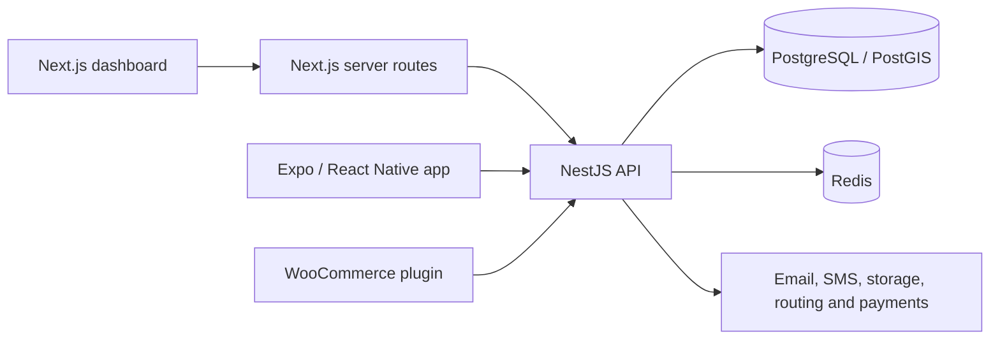

# GoMile

GoMile is a delivery platform built as an Ensimag group project. Merchants manage
orders from a web dashboard, drivers follow their assignments in a mobile app,
and a WooCommerce plugin connects online shops to the delivery API.

The `portfolio-publication` branch preserves the original project history and
commit authorship. Historical credentials have been redacted, and the environment
templates contain no external service keys.

## Features

- **Merchants:** stores, delivery estimates, orders and store API keys.
- **Drivers:** registration, document submission, assignments and delivery updates.
- **Administration:** merchant and driver management, including document review.
- **WooCommerce:** shipping estimates, order creation and signed status webhooks.
- **Integrations:** transactional email, SMS, document uploads, subscriptions and
  real-time status events.

These describe the implemented modules, not measured production performance.

## Architecture



| Directory | Responsibility | Main tools |
| --- | --- | --- |
| `apps/api` | API, authentication, orders and integrations | NestJS, Prisma, Redis, Socket.IO |
| `apps/web` | Merchant/admin dashboard and server-side API proxy | Next.js, React, TypeScript |
| `apps/mobile` | Mobile delivery workflows | Expo, React Native, TypeScript |
| `apps/plugin/woocommerce` | WooCommerce shipping integration | PHP, WordPress/WooCommerce |
| `apps/plugin/lib` | Delivery API client | TypeScript |
| `shared` | Shared requests, responses, statuses and errors | TypeScript |
| `infra` | Local infrastructure and deployment examples | Docker Compose, nginx, systemd |

The API includes adapters for OpenRouteService, AWS S3, Resend, Twilio and Stripe.

## Local setup

### Requirements

- Node.js 22; the workspace supports Node `>=20 <24`.
- pnpm **10.30.3**, pinned in `package.json`.
- Docker with Docker Compose for the local database and Redis.
- An Expo-compatible development setup for mobile work.
- PHP, Composer and WordPress/WooCommerce for plugin work.

From the repository root, with Corepack available:

```bash
corepack enable
corepack prepare pnpm@10.30.3 --activate
pnpm install --frozen-lockfile
```

### Environment files

In PowerShell:

```powershell
Copy-Item apps/api/.env.example apps/api/.env
Copy-Item apps/web/.env.example apps/web/.env.local
Copy-Item apps/mobile/.env.example apps/mobile/.env
```

On Linux/macOS, use `cp` with the same paths. Edit the copies before starting:

- Keep the local API on **4000** and the web app on **3001**.
- Set two different random JWT secrets. Generate each with
  `node -e "console.log(require('node:crypto').randomBytes(32).toString('hex'))"`.
- Supply your own provider configuration. Some API services validate it at
  startup, including storage and payments. There is no complete offline demo mode.
- On a physical phone, set `EXPO_PUBLIC_API_BASE_URL` to your computer's reachable
  LAN address, such as `http://192.168.1.10:4000`. The phone's `localhost` refers
  to the phone itself.

External credentials are intentionally empty in the templates. The Docker
database credentials are local development defaults. `NEXT_PUBLIC_` and
`EXPO_PUBLIC_` variables are visible to clients and must never contain secrets.

### Start the applications

Run migrations against a fresh **local development database**:

```bash
docker compose -f infra/docker-compose.yml up -d
pnpm --filter api exec prisma generate
pnpm --filter api exec prisma migrate deploy
```

Then start each application in its own terminal:

```bash
pnpm --filter api start:dev
pnpm --filter web dev
pnpm --filter gomileapp start
```

With the example configuration: web at `http://localhost:3001`, API at
`http://localhost:4000`, Swagger at `http://localhost:4000/docs`.

## Tests and code checks

The project includes API unit/integration tests, mobile unit tests, Cypress web
tests and PHPUnit plugin tests. Useful commands:

```bash
pnpm --filter api test:ci -- --runInBand
pnpm --filter gomileapp test -- --runInBand
pnpm --filter web typecheck
pnpm --filter web test:front
```

For the WooCommerce plugin, run `composer install` then `composer test` in
`apps/plugin/woocommerce`. API integration tests need a dedicated test database;
browser tests need the corresponding application running. Do not point tests at
the deployed application or production database.

Publication checks covered commit authorship, historical secret removal,
environment templates and the README. A complete application test run was not performed for this upload; test
files alone do not establish that every test passes.

## Documentation

- [Mobile development](apps/mobile/README.md)
- [Mobile/backend integration](apps/mobile/README.backend-api.md)
- [WooCommerce plugin](apps/plugin/woocommerce/README.md)
- [Deployment examples](infra/SETUP.md): adapt paths, users and configuration
  before use.

Historical PDF reports, report screenshots and draft design images remain with
the original project and are excluded from the public history.

## Team and provenance

Developed as a group project at Grenoble INP – Ensimag by:

- Duong Dang Khoa Dang
- Alpha Ousmane Diakite
- Youssef Jouini
- Samir Maoude
- Safwane Oudrhiri Idrissi

The original commits retain their author and committer identities and dates.
Credential removal changes affected commit IDs; the setup guide and safe
templates are added in a separate publication commit. The original GitLab
repository and running Raspberry Pi checkout remain unchanged.
